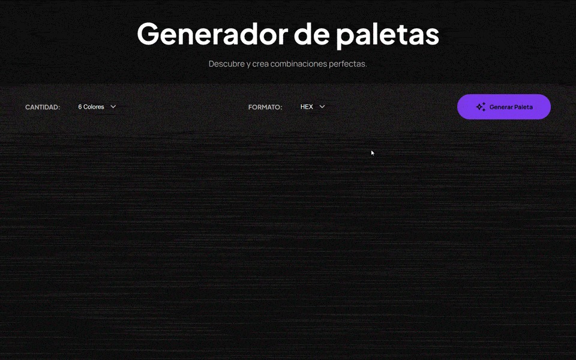

<center>

# GENERADOR DE PALETAS COLORFLY STUDIO

</center>


<div align="center">
  <p>
    <a href="https://andressripped.github.io/palette-generator-colorfly/">
      
    </a>
  </p>

  

  

  <p>
    <em>Generador interactivo construido con HTML, CSS puro y JavaScript Vanilla.</em>
  </p>
</div>

<hr />

## ✨ Características Principales

- **Generar colores al instante:** Crea paletas de colores visualmente atractivas generadas con valores **HSL** controlados para asegurar buena luminosidad y saturación.
- **Bloqueo de colores:** ¿Te gustó un color? Fíjalo haciendo clic sobre su candado. Al volver a generar, los colores bloqueados se mantendrán intactos.
- **Copiado rápido:** Toca cualquier formato para copiar el color al portapapelesal instante.
- **Tamaño personalizable:** Selecciona la cantidad de colores (6, 8 o 9) desde el selector superior.
- **Formatos:** Cambia todos los códigos de colores visibles entre formato **HEX** y **HSL** en tiempo real.

## 🛠️ Tecnologías y Herramientas

<p align="center">
    
    
    
  </p>

- **Estructura:** HTML5 semántico.
- **Estilos:** CSS3 puro. Sistema de **Variables CSS** (Custom Properties) para consistencia de tema, paleta y tipografías (Manrope y Plus Jakarta Sans). Animaciones mediante `@keyframes`.
- **Lógica:** JavaScript (ES6+). Implementación de la API `navigator.clipboard`, matemáticas de color complejas y manipulación estructural profunda del DOM.
- **Uso de IA**: Documentacion sobre el uso de la IA (Prompts y resultados generados) **[AQUÍ.](https://drive.google.com/drive/folders/1VolrrGUycN7Y4a9yykTVdcIOTHVp6yMt?usp=sharing)**

## 🚀 Uso e Instalación

### Visualización Rápida
¡El proyecto está público y subido a GitHub Pages! Puedes probarlo haciendo clic en el botón superior de demo o desde aquí: **[Colorfly](https://andressripped.github.io/palette-generator-colorfly/)**

### Montaje Local
Si prefieres descargar el código, sigue estos pasos:

1. Clona este repositorio:
   ```bash
   git clone https://github.com/andressripped/palette-generator-colorfly
   ```
2. Ejecuta o arrastra el archivo `index.html` hacia tu navegador. ¡A generar colores!

## 📂 Organización del Proyecto

```text
/
├── assets/
│   └── demo.gif       # Archivos multimedia de la documentación.
├── css/
│   └── styles.css      # Hoja de estilos principal y animaciones.
├── js/
│   └── main.js         # Motor JavaScript, conversiones y eventos.
└── index.html          # Punto de entrada y esqueleto de la aplicación.
```

## 🧠 Aprendizajes Clave

1. Destreza manipulando elementos dinámicos en cascada mediante JavaScript Vanilla (`createElement`, uso de atributos `dataset`).
2. Algoritmos de conversión complejos (pasando de matriz `H S L` a codificación pura `HEX`).
3. Feedback asíncrono e instantáneo para UX (uso de temporalizadores para tooltips tras interactuar con la Clipboard API).

---
<div align="center">
  <b>⭐️ Si te ha gustado, ¡no dudes en dejarle una estrella al repositorio!</b>
</div>
